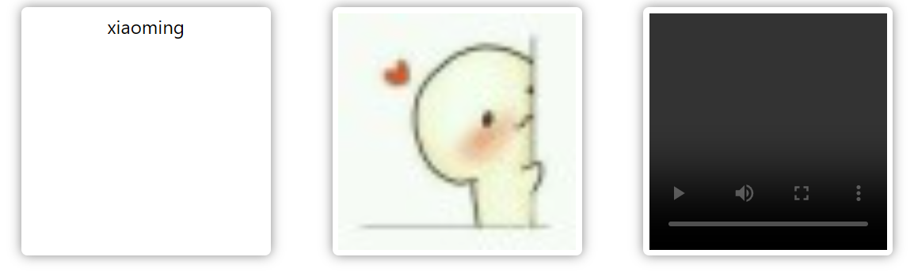

# 默认插槽

插槽用于父组件向子组件传递模板结构，子组件在自身结构内直接显示父组件传递的结构。

`Child.vue`

```vue
<script setup></script>

<template>
  <div class="wrapper">
    <slot />
  </div>
</template>

<style scoped>
.wrapper{
  width: 200px;
  border-radius: 5px;
  padding: 5px;
  box-shadow: 0px 0px 10px gray;
}
</style>
```

子组件在自身结构内声明了 `<slot/>`结构，用于指定父组件传递的结构放置的位置。

`App.vue`

```vue
<script setup>
import Child from './Child.vue'
import { ref } from 'vue';

const name = ref('xiaoming')
const imgUrl = ref('https://www.gravatar.com/avatar/dc1748b98de6fc8de933e9d4c2b26fc0?s=56')
const videoUrl = ref('http://clips.vorwaerts-gmbh.de/big_buck_bunny.mp4')

</script>

<template>
  <div class="wrapper">
    <Child>
      {{name}}
    </Child>
    <Child>
      
    </Child>
    <Child>
      <video :src="videoUrl" controls/>
    </Child>
  </div>
</template>
```

父组件将子组件写成双标签的形式，便于在标签内部声明需要传递给子组件的结构

如图所示，在同一子组件中，显示了来自父组件传递的不同结构。

# 具名插槽

具名插槽用于当子组件具有多个插槽时，需要指定哪部分结构放置在哪个插槽的位置。

`Child.vue`

```vue
<template>
  <div class="container">
    <header>
      <slot name="header"></slot>
    </header>
    <main>
      <slot></slot>
    </main>
    <footer>
      <slot name="footer"></slot>
    </footer>
  </div>
</template>
```

子组件申明了三个插槽，其中有两个具名插槽和一个默认插槽

`App.vue`

```vue
<script setup>
import Child from './Child.vue'
</script>

<template>
  <BaseLayout>
    <template #header>
      <h1>页面标题</h1>
    </template>

    <template #default>
      <p>页面内容1</p>
    </template>

    <template #footer>
      <p>联系方式</p>
    </template>
  </BaseLayout>
</template>
```

父组件通过 `<template #插槽名>xxx</template>`来指定传递给子组件的结构以及对应放置的插槽名称。
**注意**：`#header`是指定插槽的简写方式，还可以写成 `v-slot:header`

# 作用域插槽

聊到作用域插槽，我们首先要知道，父组件指定的插槽内容访问不到子组件的数据，作用域插槽就是解决这个问题的

`Child.vue`

```vue
<script setup>
    const greetingMessage = 'hello'
</script>

<template>
    <div>
        <slot :text="greetingMessage" :count="1"></slot>
    </div>
</template>
```

子组件通过在 `<slot></slot>`上传递 `props`，将自身的数据传递给父组件的插槽结构

`App.vue`

```vue
<script setup>
    import Child from './Child .vue'
</script>

<template>
    <Child v-slot="slotProps">
        {{ slotProps.text }} {{ slotProps.count }}
    </Child>
</template>
```

父组件通过 `v-slot="slotProps"`接收子组件的数据。

解构slotProps的写法：`v-slot="{text, count}"`

具名作用域插槽的写法: `v-slot:slotName = "{text, count}"` 或简写为：`#slotName = "{text, count}"`
