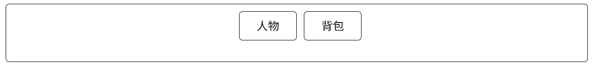
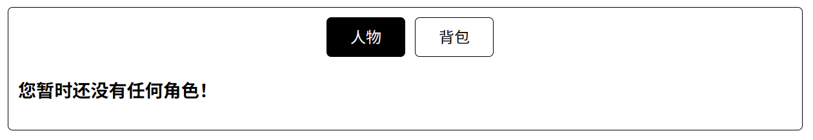
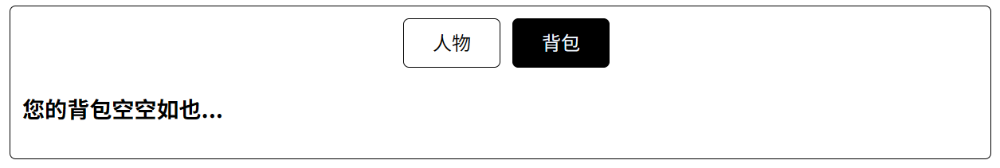
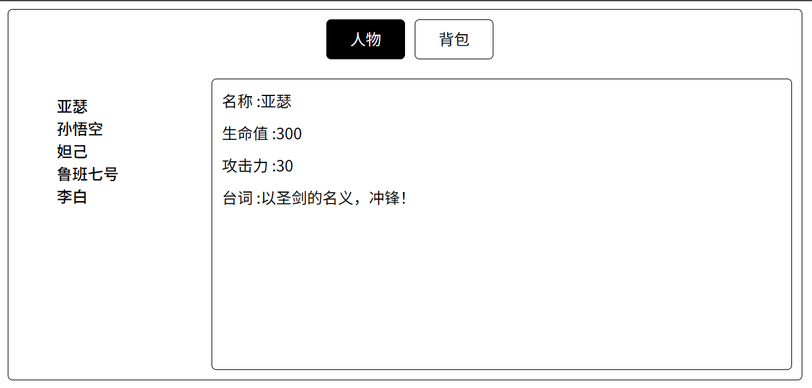
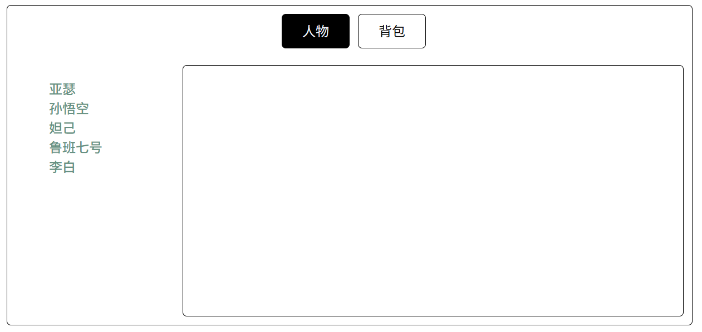
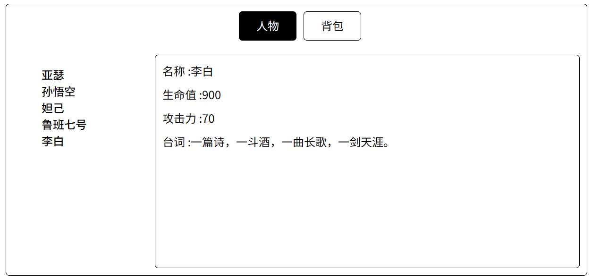

## 一、创建路由器

1.在项目的 `src/router/`目录下创建 `index.ts`文件

```javascript
import {createRouter, createWebHistory} from "vue-router"

// 预先定义好了两个组件
import Characters from "@/components/Characters.vue"
import BackPack from "@/components/BackPack.vue"

const router = createRouter({
    history:createWebHistory(),
    // 声明了两条路由规则，分别指向两个组件
    routes:[
        {
            name:"characters",      // 路由名称
            path:"/characters",     // 路由路径
            component:Characters,   // 路由组件
        },
        {
            name:"backpack",  
            path:"/backpack",
            component:BackPack
        }
    ]
})

export default router
```

2.在 `main.ts`中添加以下代码来启用路由器

```javascript
import router from "./router"
app.use(router)
```

此时，路由器启用成功了！

## 二、路由器的基本使用

1.首先需要引入两个组件：`RouterLink`和 `RouterView`。

```vue
<template>
    <div class="wrapper">
        <div>
            <RouterLink to="/characters" class="nav" active-class="navActive">人物</RouterLink>
            <RouterLink to="/backpack" class="nav" active-class="navActive">背包</RouterLink>
        </div>
        <div>
            <RouterView />
        </div>
    </div>
</template>

<script setup lang="ts">
import { RouterLink, RouterView } from 'vue-router';
</script>
```

`RouterLink`组件的 `to`属性可以设置跳转的路径。
`RouterView`组件用于指定当前路由路径对应的组件所放置的区域。

页面初始状态
`http://localhost:5173/`

点击“人物”
`http://localhost:5173/news`


点击“背包”
`http://localhost:5173/about`



此时，我们就实现了一个简单的路由跳转。

## 三、路由的嵌套

在上面的例子中，我们实现了通过 `/character`和 `/backpack`两个路由配置将 `Character`组件和 `Backpack`组件展示在 `App`组件中。

那么如果在 `Character`组件中还有一个子组件需要通过路由展示，需要怎么做呢？

首先，我们对 `Character`组件进行小小的更改，使其内部也包含一个‘导航区’和‘展示区’。

左侧为导航区，右侧为展示子路由组件的展示区。



```vue
<template>
    <div class="hero_wrapper">
        <!-- 没有英雄时 -->
        <h3 v-if="herosList.length == 0">您暂时还没有任何角色！</h3>
        <div class="left">
            <!-- 有英雄 -->
            <ul>
                <li v-for="hero in herosList" :key="hero.id">
                    // 导航到/characters/heroInfo路径
                    <RouterLink class="hero_nav" to="/characters/heroInfo">{{ hero.name }}</RouterLink>
                </li>
            </ul>
        </div>
        <div class="right">
            <RouterView></RouterView>
        </div>
    </div>
</template>

<script setup lang="ts">
import { reactive } from 'vue';
import { RouterLink, RouterView } from 'vue-router';

let herosList = reactive([
    { id: "h1", name: "亚瑟", health: 300, attack: 30, dialogue: "以圣剑的名义，冲锋！" },
    { id: "h2", name: "孙悟空", health: 100, attack: 80, dialogue: "俺老孙来也！" },
    { id: "h3", name: "妲己", health: 80, attack: 100, dialogue: "请尽情吩咐妲己，主人~" },
    { id: "h4", name: "鲁班七号", health: 50, attack: 120, dialogue: "检测了对面的智商，嘿嘿嘿，看来无法发挥全部实力啦！" },
    { id: "h5", name: "李白", health: 900, attack: 70, dialogue: "一篇诗，一斗酒，一曲长歌，一剑天涯。" },
])

</script>
```

对路由器文件也需要稍作修改，需要对路由规则按照组件的嵌套层级在 `children`属性中也进行相应的嵌套。
**这里需要注意一点：子路由的path属性前不需要加 `/`了，否则会路由会匹配失败。**

```javascript
import {createRouter, createWebHistory} from "vue-router"

import Characters from "@/components/Characters.vue"
import HeroInfo from "@/components/HeroInfo.vue"
import BackPack from "@/components/BackPack.vue"

const router = createRouter({
    history:createWebHistory(),
    routes:[
        {
            name:"characters",  // 人物
            path:"/characters",
            component:Characters,
            children:[
                {
                    name:"heroInfo",
                    path:"heroInfo",
                    component:HeroInfo
                }
            ]
        },
        {
            name:"backpack",    // 背包
            path:"/backpack",
            component:BackPack
        }
    ]
})

export default router
```

此时点击左侧英雄名称即可显示子路由组件



## 四、路由传参

### query传参

我们常在网址中看到以下格式：`https://www.baidu.com/s?tn=baidu&ie=utf-8`。
这个网址可以拆分成两部分 `https://www.baidu.com/`和 `?tn=baidu&ie=utf-8`。
后者即网址携带的query参数。

我们同样可以在 `RouterLink`的 `to`属性中添加query参数:`?key1=value1&key2=value2....`。
那么所有的 `key,value`都可以在对应的组件中通过 `useRoute().query`取得。

```vue
<template>
    <!-- 这里省略了其他结构 -->
    <RouterLink class="hero_nav"
                :to="`/characters/heroInfo?id=${hero.id}&name=${hero.name}&health=${hero.health}&attack=${hero.attack}&dialogue=${hero.dialogue}`"
                        active-class="hero_nav_active">{{ hero.name\}}</RouterLink>
</template>

<script setup lang="ts">
import { reactive } from 'vue';
import { RouterLink, RouterView } from 'vue-router';

let herosList = reactive([
    { id: "h1", name: "亚瑟", health: 300, attack: 30, dialogue: "以圣剑的名义，冲锋！" },
    { id: "h2", name: "孙悟空", health: 100, attack: 80, dialogue: "俺老孙来也！" },
    { id: "h3", name: "妲己", health: 80, attack: 100, dialogue: "请尽情吩咐妲己，主人~" },
    { id: "h4", name: "鲁班七号", health: 50, attack: 120, dialogue: "检测了对面的智商，嘿嘿嘿，看来无法发挥全部实力啦！" },
    { id: "h5", name: "李白", health: 900, attack: 70, dialogue: "一篇诗，一斗酒，一曲长歌，一剑天涯。" },
])

</script>
```

`HeroInfo`组件

```vue
<template>
    <div class="heroInfo">
        <span class="heroInfo_property">名称 :{{ query.name }}</span>
        <span class="heroInfo_property">生命值 :{{ query.health }}</span>
        <span class="heroInfo_property">攻击力 :{{ query.attack }}</span>
        <span class="heroInfo_property">台词 :{{ query.dialogue }}</span>
    </div>
</template>

<script setup lang="ts">
import { toRefs } from 'vue';
import { useRoute } from 'vue-router';
const route = useRoute();
// 必须使用toRefs包裹再解构，直接解构会失去响应性
let { query } = toRefs(route);
</script>
```

`http://localhost:5173/characters/heroInfo?id=h1&name=亚瑟&health=300&attack=30&dialogue=以圣剑的名义，冲锋！`


`http://localhost:5173/characters/heroInfo?id=h5&name=李白&health=900&attack=70&dialogue=一篇诗，一斗酒，一曲长歌，一剑天涯。`



### `query`传递参数的对象形式写法

```vue
<RouterLink class="hero_nav" :to="{
                        path: '/characters/heroInfo',
                        query: {
                            id: hero.id,
                            name: hero.name,
                            health: hero.health,
                            attack: hero.attack,
                            dialogue: hero.dialogue
                        }
                    }" active-class="hero_nav_active">{{ hero.name
                    }}</RouterLink>
```

只需要在 `RouterLink`的 `to`属性中传递一个包含 `path`和 `query`的对象，在 `query`配置项中即可指定参数。

### params传参

通过 `query`传递参数时，我们需要在指定的路径后添加一系列的参数，这就导致结构非常不清晰，可读性很差。

所以接下来介绍另外一种通过对象传递路由参数的方式：`params`传参。

第一步、在路由规则中添加占位符

```javascript
routes:[
        {
            name:"characters",  // 人物
            path:"/characters",
            component:Characters,
            children:[
                {
                    name:"heroInfo",
                    path:"heroInfo/:id/:name/:health/:attack/:dialogue", // 看这里
                    component:HeroInfo
                }
            ]
        }
    ]
```

第二步、在 `RouterLink`中指定参数
只需在占位符相应的位置添加参数。

```vue
<li v-for="hero in herosList" :key="hero.id">
                    <RouterLink class="hero_nav"
                        :to="`/characters/heroInfo/${hero.id}/${hero.name}/${hero.health}/${hero.attack}/${hero.dialogue}`"
                        active-class="hero_nav_active">
                        {{ hero.name }}
                    </RouterLink>
</li>
```

第三步、读取 `params`参数

```vue
<template>
    <div class="heroInfo">
        <span class="heroInfo_property">名称 :{{ params.name }}</span>
        <span class="heroInfo_property">生命值 :{{ params.health }}</span>
        <span class="heroInfo_property">攻击力 :{{ params.attack }}</span>
        <span class="heroInfo_property">台词 :{{ params.dialogue }}</span>
    </div>
</template>

<script setup lang="ts">
import { toRefs } from 'vue';
import { useRoute } from 'vue-router';
const route = useRoute();
let { params } = toRefs(route);
</script>
```

### `params`传递参数的对象形式写法

与 `query`类似，`params`也有对象形式写法，不过与之不同的是，必须要在 `to`中指定路由名称 `name`，而不能使用 `path`

```vue
<li v-for="hero in herosList" :key="hero.id">
      <RouterLink class="hero_nav" :to="{
            name: 'heroInfo',
            params: {
                id: hero.id,
                name: hero.name,
                health: hero.health,
                attack: hero.attack,
                dialogue: hero.dialogue
            }
          }" active-class="hero_nav_active">
          {{ hero.name }}
      </RouterLink>
</li>
```

### 路由props配置传参

Vue组件分为两种：一般组件，路由组件。

如果想要向一个一般组件传递参数，我们格式使用props传参：

```vue
    <Child id="1" name="zhangsan" age="20" />
```

通过props传递的参数，我们可以直接在该组件中获取

```vue
<template>
    <span>{{ id }}</span>
    <span>{{ name }}</span>
    <span>{{ age }}</span>
</template>

<script setup lang="ts">
    import {defineProps} from 'vue';
  
    defineProps(["id", "name", "age"]);
</script>
```

可以看到，通过这种方式传递参数时非常方便接收和使用的。
但是一般来说，路由组件都是渲染在 `<RouterView>`中的，不需要我们自己写组件标签，所以也就没有机会在标签中传递props属性。

为了解决这个问题，路由器中可以添加一个新的配置项: `props`，使得vue可以将我们的路由参数转换为props参数传递给组件。

```javascript
routes: [
    {
      name: 'characters', // 人物
      path: '/characters',
      component: Characters,
      children: [
        {
          name: 'heroInfo',
          path: 'heroInfo/:id/:name/:health/:attack/:dialogue',
          component: HeroInfo,
          props: true   // 为HeroInfo路由组件添加props配置项
        },
      ],
    },
    {
      name: 'backpack', // 背包
      path: '/backpack',
      component: BackPack,
    },
  ]
```

当添加 `props:true`配置项时，vue编译器在路由到该组件时，会自动向组件上添加所有的 `params`参数。

这是第一种用法，且该方法只能传递 `params`参数。

第二种方法是将props配置项写成一个函数，该函数接受一个参数:route，且该函数需要返回一个对象，对象中所有属性都会添加到组件的props上。

```javascript
   props(route){   // 为HeroInfo路由组件添加props配置项
       return route.query;
   }
```

第三种方法则是直接配置为一个对象，该对象中的所有属性都会添加到组件的props上。但是这种方式传递的参数一般都是固定的，不常用。

```javascript
   props:{   // 为HeroInfo路由组件添加props配置项
        a:1,
        b:2,
        c:3
   }
```

## 路由重定向

我们此时定义了三个路由规则：`/characters`，`/backpack`，`/characters/heroInfo`。
但是当我们刚进入网站时，实际的路由为：`/`。
所以什么组件都不显示，且控制台会报一个警告

![2025-05-25T15:04:03.png][9]

此时我们可以将默认首页设置为 `/characters`，那么就需要在路由器中设置重定向规则。

```javascript
routes: [
    ...
    {
      path: '/',    // 将该路径进行重定向
      redirect: '/characters',
    },
  ],
```

[1]: http://139.129.32.36/usr/uploads/2025/05/3378691440.png
[2]: http://139.129.32.36/usr/uploads/2025/05/3717130931.png
[3]: http://139.129.32.36/usr/uploads/2025/05/519552396.png
[4]: http://139.129.32.36/usr/uploads/2025/05/1603402387.png
[5]: http://139.129.32.36/usr/uploads/2025/05/3375135720.png
[6]: http://139.129.32.36/usr/uploads/2025/05/743606571.png
[7]: http://139.129.32.36/usr/uploads/2025/05/2611777781.png
[8]: http://139.129.32.36/usr/uploads/2025/05/985565852.png
[9]: http://139.129.32.36/usr/uploads/2025/05/1935792238.png
